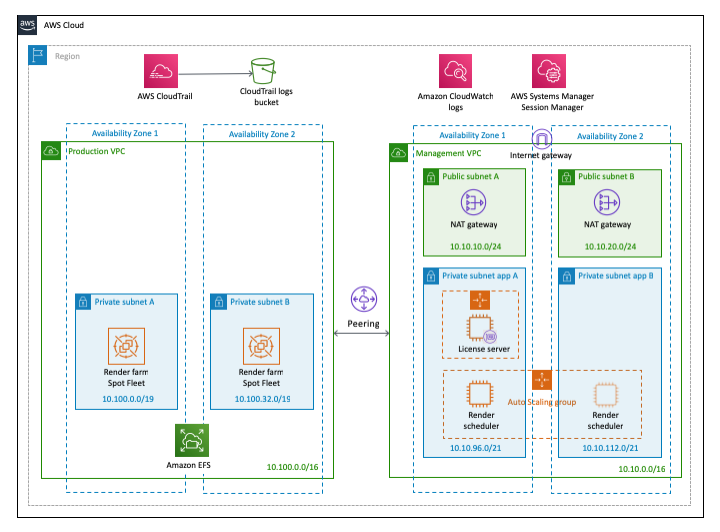

# quickstart-vfx-ise
## VFX Burst Rendering on the AWS Cloud Using ISE Recommendations

This Quick Start deploys an AWS Cloud environment that helps media and entertainment organizations with burst rendering workloads. This environment helps VFX studios meet Independent Security Evaluators (ISE) standards and guidelines.

The Quick Start will deploy a standard VFX burst rendering architecture using multiple virtual private clouds (VPCs).

For architectural details, best practices, step-by-step instructions, and customization options, see the 
[deployment guide](https://fwd.aws/nVNxn).

For information about how the deployed and customized VFX burst rendering environment on the AWS Cloud should be implemented to meet ISE best practices and recommended security controls, see the [security controls mapping document](assets/ISE Compliant VFX Burst Rendering on AWS - Security Control Mapping.docx). This mapping provides your VFX studio with the guidance needed to demonstrate, document, and prepare the VFX burst rendering environment for an ISE security audit.  

To post feedback, submit feature ideas, or report bugs, use the **Issues** section of this GitHub repo.
If you'd like to submit code for this Quick Start, please review the [AWS Quick Start Contributor's Kit](https://aws-quickstart.github.io/).
